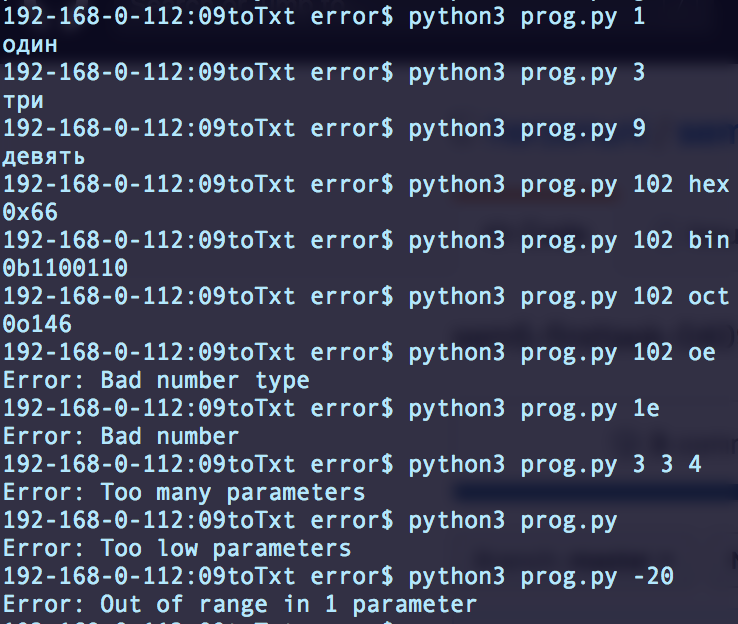
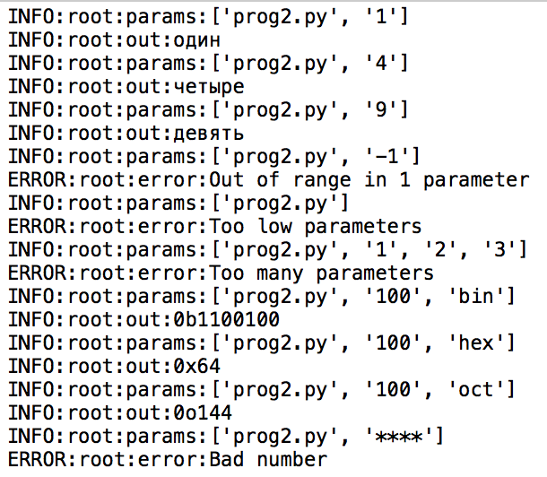

# sem5-firsttask-04092018

## Задача 1

Напишите программу, в которой пользователь вводит число от 0 до 9 включительно, а программа выводит название введённого числа, а если второй входной аргумент ```type``` имеет значение ```bin```, ```oct```,```hex```, то функция преобразует это число в бинарную, восьмеричную или шестнадцатеричную форму. Предусмотреть проверку корректности введённого пользователем значения. При реализации должны использоваться декораторы. 
При реализации должны использоваться декораторы (но можно обойтись и без них). 
Предусмотрите обработку исключительных ситуаций. 
Напишите тесты с использованием assert.

## Задача 2
На основе созданного в рамках лабораторного занятия 1 программного кода напишите фрагмент кода (класс) для обработки исключительных ситуаций, которые могут возникнуть в процессе выполнения кода (см. задание ЛР 1), упомянутого выше

## Задача 3
Для программы, сделанной в рамках лабораторной работы 1 и 2, реализуйте с использованием механизма декораторов (предпочтительно) или без него (в этом случае будет необходимо использовать еще один аргумент) функционал для сохранения истории вычислений функции в файл.

**Данная программа реализует все 3 задачи**

---

---

